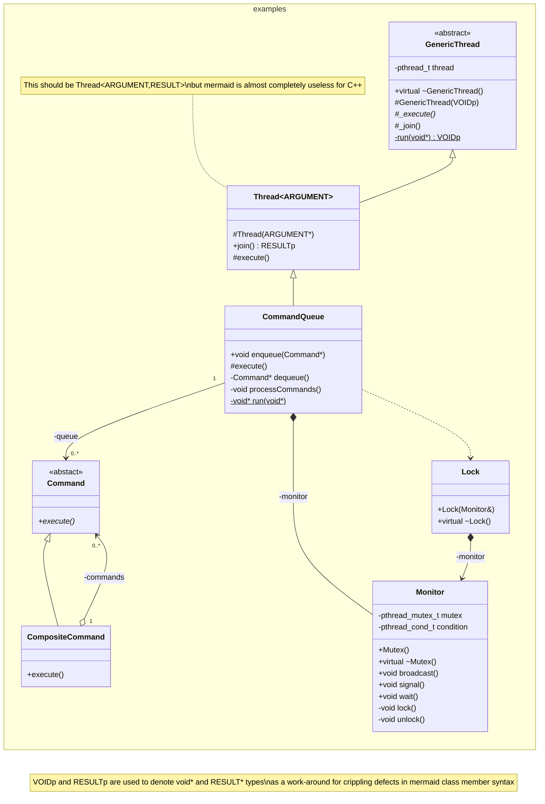

Copyright © 2016-2026 Kirk Rader

# cppExamples

C++ implementation of a thread-synchronization class modeled on Java's "monitors."

This exists as an example both of wrapping a native API in a C++ class
and as a demonstration of basic multi-threaded application design.



## Dependencies

### Compile and Link

```bash
sudo apt install -y build-essential
```

### Documentation

[doxygen] 1.18.0 or later

_**Warning:** As of this writing, the version of `doxygen` installed by `apt` in
Ubuntu is years out of date, as for many commonly used packages._

## Build

### Library and Unit Tests

```bash
make cleanall unit_tests
```

### Documentation

```bash
make cleandocs docs
```

## TODO: convert plantuml to mermaid

```
@startuml{examples_CommandQueue_activity.png}
scale max 500*600
'title Activity depicting asynchronous\ninvocation of two commands\nfollowed by application\ntermination after both\ncommands have completed
(*) --> ===B1===
partition "application thread" {
    --> "some work..." as one
    --> queue.enqueue(command1)
    --> "...more work..." as two
    --> queue.enqueue(command2)
    --> "...even more work..." as three
    --> queue.enqueue(null)
    --> queue.join()
}
--> ===B2===
--> (*)
partition "queue thread" {
    ===B1=== --> "dequeue()" as wait
    if "" then
        --> [null\ncommand] ===B2===
    else
        --> [valid\ncommand] command.execute()
        if "" then
            --> [command\nthrew\nexception] log(exception)
            --> wait
        else
            --> [command\nexited\nnormally] wait
        endif
    endif
}
@enduml
```

```
@startuml{examples_CommandQueue_state.png}
scale max 500*600
state wait
wait: dequeue()
state run
run: command->execute()
state error
error: log(exception)
[*] -> wait
wait -> run: valid command
wait --> [*]: null\ncommand
run -> wait: command exists normally
run --> error: command\nthrows\nexception
error -up-> wait : error\nlogged
@enduml
```

[doxygen]: https://www.doxygen.nl